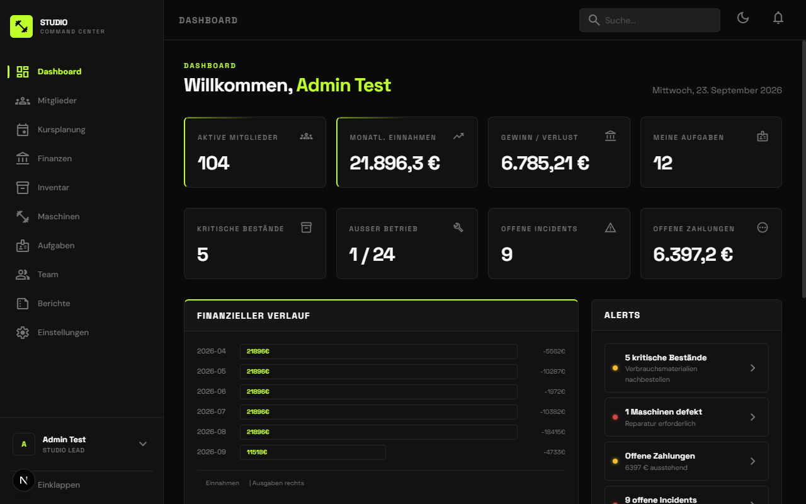
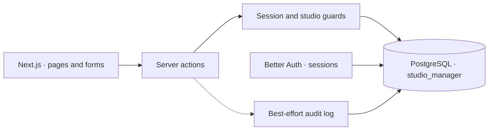
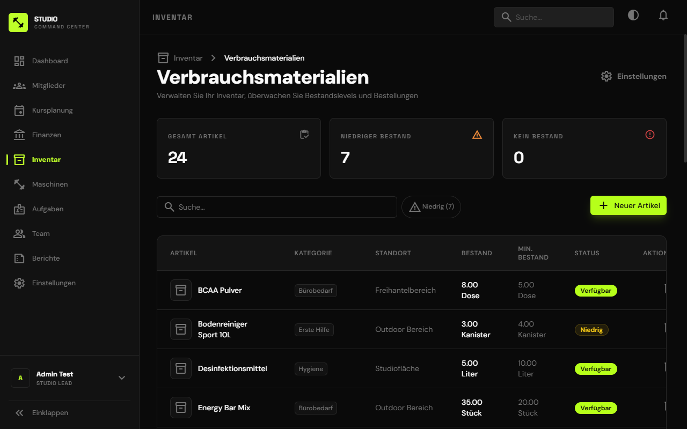
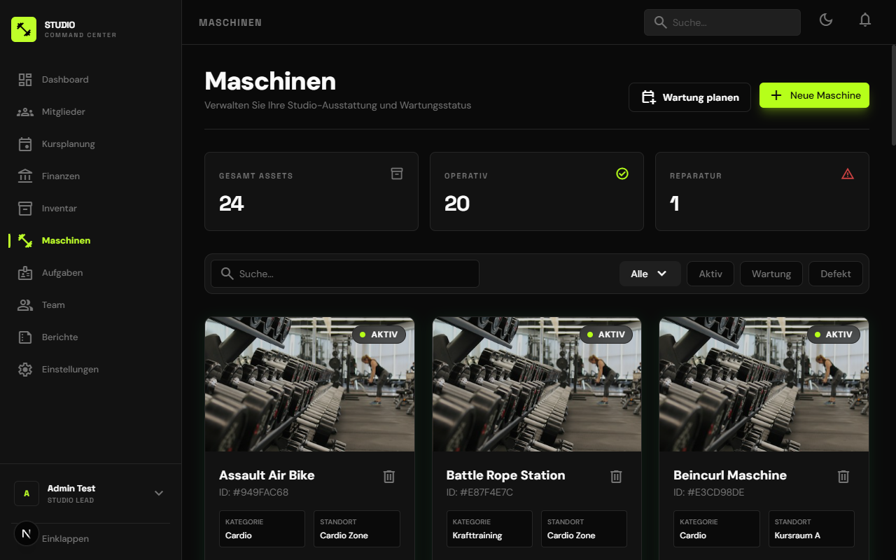
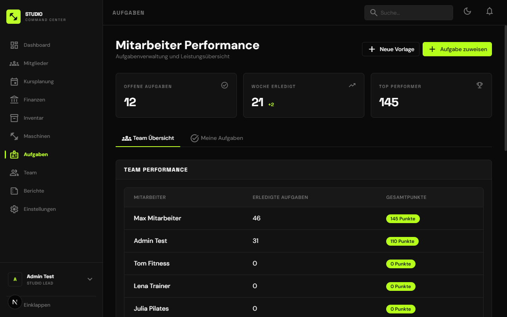
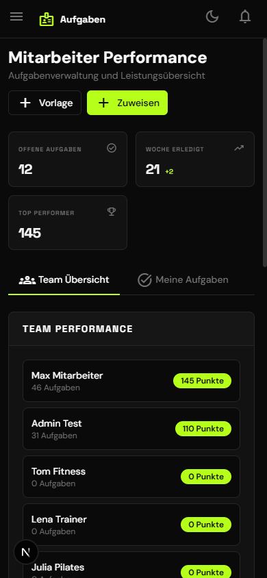

<h1 align="center">Studio Command Center</h1>
<p align="center"><strong>The daily operations of a fitness studio, in one place.</strong></p>
<p align="center">
  <a href="LICENSE"></a>
  
  
  
</p>
<p align="center">
  <a href="#quickstart">Quickstart</a> · <a href="#architecture">Architecture</a> · <a href="#screenshots">Screenshots</a> · <a href="docs/README.md">Documentation</a>
</p>



A studio operations application for inventory, equipment maintenance, staff tasks, members, classes and financial summaries. Next.js server actions connect a German-language interface to PostgreSQL and Better Auth.

## Why this exists

Stock shortages, broken equipment and unfinished tasks are easy to lose across chats and spreadsheets. I built a shared operational view with roles, studio-scoped records and a history of changes.

| Stock | Equipment | Staff |
| :--- | :--- | :--- |
| Consumables, thresholds and stock movements | Machine registry, incidents and maintenance | Assignments, completion evidence and points |
| See what needs replenishing | See what needs attention | See who is responsible |

**Status:** portfolio prototype with seeded demonstration data. Studio scoping is implemented in application queries; it is not a claim of independently verified tenant isolation. Audit writes are best-effort. [Implementation boundaries →](docs/architecture.md#current-boundaries)

## Quickstart

Requires Bun and a dedicated local PostgreSQL database (14+).

```bash
git clone https://github.com/Gjusev/studio-command-center.git
cd studio-command-center
bun install --frozen-lockfile
cp .env.example .env
# Set DATABASE_URL to your local database and generate BETTER_AUTH_SECRET.
bun run db:migrate
bun run db:demo
bun run dev
```

Open [localhost:3000](http://localhost:3000) and use the demo sign-in controls. The sample environment enables demo mode; use it only with demonstration data. Seeding writes synthetic business records to the configured database.

The interface distinguishes **Studioleiter** (manager) and **Mitarbeiter** (staff). [Environment, setup and verification →](docs/getting-started.md)

## Architecture



Application data is scoped by `studio_id`; Better Auth handles sessions and includes organization support. Queries use `postgres.js`, while authentication uses a separate PostgreSQL pool. [Data flow and design decisions →](docs/architecture.md)

## Screenshots

| Inventory | Equipment |
| :---: | :---: |
|  |  |

<details>
<summary><strong>Staff tasks and mobile layout</strong></summary>

| Tasks | Mobile |
| :---: | :---: |
|  |  |

</details>

All screenshots use synthetic demonstration data; displayed revenue and member counts are not business results.

## Engineering decisions

| Decision | Benefit | Tradeoff |
| :--- | :--- | :--- |
| Server actions and Zod | Forms and validation stay close to the application | Authorization must be applied at every mutation boundary |
| Explicit SQL | Studio scoping and joins are visible | More responsibility for query consistency |
| Better Auth | Session and organization primitives | App-specific studio membership still needs its own rules |
| One PostgreSQL schema | Simple operational footprint | Tenant isolation depends on query and guard correctness |

## What I'd do differently

- **Adopt versioned migrations earlier.** A schema bootstrap is useful locally but is not a complete upgrade strategy for existing installations.
- **Make audit persistence transactional.** The current logger catches failures; an operation can succeed without its audit entry.
- **Test tenant boundaries before expanding modules.** Explicit membership provisioning and negative authorization tests should precede production use.

[Documentation index](docs/README.md) · [Architecture](docs/architecture.md) · [Setup and checks](docs/getting-started.md)

---

Built by **Youssef Ouhaghi Ahmian** · [Mokka](https://mokka-agentur.de) · [GitHub](https://github.com/Gjusev)  
Released under the [MIT license](LICENSE).
