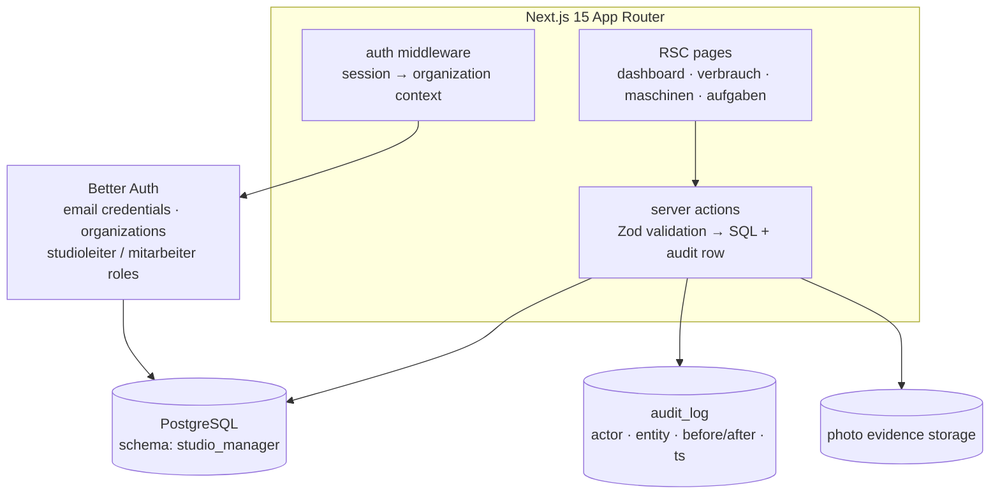

# Architecture

Studio Command Center is a single Next.js application serving multiple
fitness studios (tenants). Multi-tenancy is organizational: Better Auth
organizations map to studios, and every query is scoped by the organization
id of the signed-in session.

## Runtime shape



## Data model (core)

- **organizations / users / accounts** — Better Auth tables; membership ties
  a user to a studio with a role.
- **consumables** — categories, locations, min-stock thresholds; stock levels
  derive from **movements** (in/out, reason, actor) — never mutated in place.
- **machines** — registry with status; **maintenance events** record repairs,
  costs and downtime.
- **tasks** — assignments to staff with due dates; completion requires photo
  evidence; a points system rewards completions and feeds staff metrics.
- **audit_log** — append-only; server actions write the audit row in the same
  transaction as the mutation.

## Decisions

| Decision | Why |
|---|---|
| **Raw SQL via postgres.js, no ORM** | The domain is a handful of relations with tenant-scoped queries; explicit SQL keeps permissions and scoping visible in the query text. |
| **Server actions + Zod** | One validated mutation path per operation; forms call actions directly, no separate API layer to secure. |
| **Better Auth organizations** | Multi-tenancy needed org-scoped sessions and roles without hand-rolling either. |
| **Append-only stock and audit** | Movements and audit rows are facts; current values are projections. History can always be replayed. |
| **Schema-per-database, tenant rows scoped** | One `studio_manager` schema; isolation enforced at query level by organization id — simple to back up per studio. |
| **Playwright e2e seeded via HTTP** | The seed exercises the real signup/task flows (including photo upload paths) rather than fabricating rows. |

## Run and verify

```bash
bun install
cp .env.example .env         # DATABASE_URL, BETTER_AUTH_SECRET, BETTER_AUTH_URL
bun run db:migrate           # schema.sql + module schemas, idempotent
bun run db:demo              # mock business data
bun run dev                  # localhost:3000
bun scripts/create-e2e-test-data.mjs   # test users via the running server
bun run test:e2e             # Playwright suite
```

## Current boundaries

Honest limits of this prototype, stated so nobody has to discover them:

- **Tenant isolation is application-level.** Studio scoping lives in the
  queries and guards (`studio_id`), not in row-level security or separate
  schemas per tenant. It is implemented, not independently verified.
- **Audit writes are best-effort.** The audit logger catches its own
  failures; an operation can succeed without its audit entry persisting.
  Transactional audit is a planned change, not a shipped one.
- **Schema bootstrap, not upgrade migrations.** `db:migrate` applies the
  current schema and module schemas; it is not a versioned migration
  strategy for installations already holding data.
- **Authorization is per-mutation.** Server actions apply guards at each
  boundary; negative authorization tests do not yet exist as a suite.
