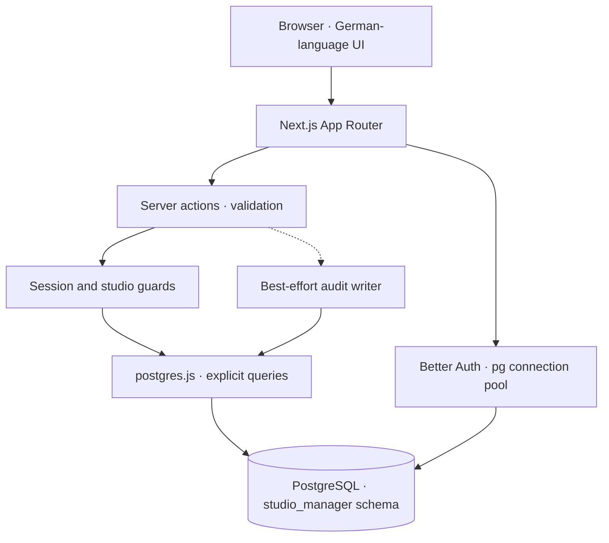

# Studio Command Center architecture

[← Documentation](README.md) · [Getting started](getting-started.md)

A Next.js application combines studio operations, Better Auth sessions and
PostgreSQL persistence. Business records use `studio_id`; authorization is
implemented in application guards and queries.

## Request and data flow

## Code map

| Boundary | Implementation | Responsibility |
| :--- | :--- | :--- |
| Authentication | [auth.ts](../src/lib/auth.ts) | Better Auth configuration and sessions |
| Authorization | [guards.ts](../src/lib/auth/guards.ts) | Application user, role and studio context |
| Business operations | [actions/](../src/app/actions/) | Validation, queries and mutations |
| Data access | [db/index.ts](../src/lib/db/index.ts) | Reserved connections, search path and transaction helper |
| Audit | [audit/index.ts](../src/lib/audit/index.ts) | Actor, entity, before/after data and action history |
| Bootstrap | [migrate.mjs](../scripts/migrate.mjs) | Base schema followed by module schemas |

## Data model

- **Studios and application users** connect business records to a studio and role.
  Better Auth maintains authentication records and has organization support;
  it is not a replacement for application-specific studio membership.
- **Consumables and movements** retain stock changes alongside current stock.
  Current stock is updated; the implementation is not a pure event-sourced model.
- **Machines and maintenance events** record equipment status, incidents and costs.
- **Tasks** connect assignments, completion evidence and staff points.
- **Members, classes, contracts and finances** support the wider operational dashboard.
- **Audit logs** record business actions through a separate helper.

## Decisions and tradeoffs

| Decision | Rationale | Consequence |
| :--- | :--- | :--- |
| Next.js pages and server actions | Keep UI and mutations in one application | Guards must protect each server boundary |
| Explicit SQL via postgres.js | Make studio scoping and joins inspectable | Query correctness is the application's responsibility |
| Better Auth | Reuse session and organization primitives | Business membership still needs explicit provisioning |
| Shared PostgreSQL schema | Keep the deployment small | Application scoping needs dedicated negative tests |
| Best-effort auditing | An audit failure does not block a business action | Audit completeness is not guaranteed |

## Current boundaries

**This repository is a portfolio prototype, not a verified production tenancy boundary.**

The current audit helper catches insertion errors. Audit writes are not
atomically committed with every business mutation. The previous documentation's
transactional-audit guarantee did not describe the implementation.

Studio membership provisioning needs further review: some onboarding helpers
choose an existing studio for an unprovisioned user. Before accepting unrelated
real studios, implement explicit membership assignment and exercise negative
cross-studio authorization cases.

The migration script bootstraps schema files and tolerates some existing-object
errors. It has no migration ledger and does not guarantee a safe upgrade from
all earlier schema versions. Use a versioned migration strategy before operating
an installation with real data.

Demo mode and synthetic seed data are intended for a local demonstration.
Disable demonstration controls and replace demo accounts before any deployment
with real users. Screenshot member counts and revenue are synthetic.

## Verification

See [Getting started](getting-started.md#checks) for lint and browser-test
commands. Browser tests require a running app, a dedicated test database and
seeded accounts. A successful lint run does not verify tenant isolation.
